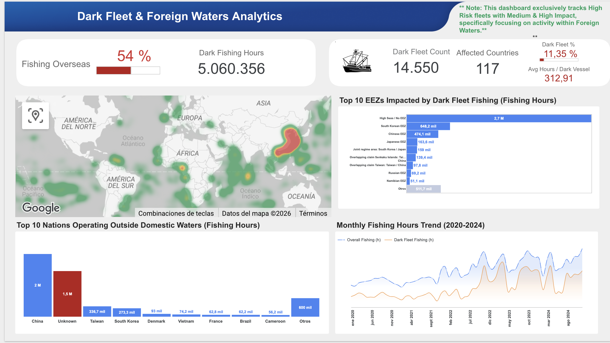
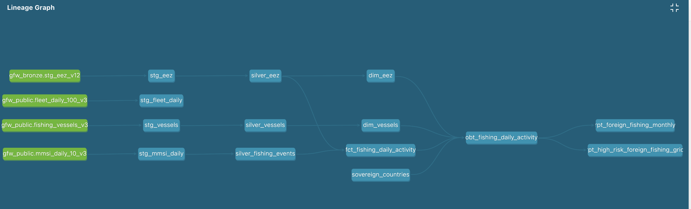

# 🌊 Dark Fleet & Foreign Waters Analytics

> An end-to-end geospatial analytics project for exploring foreign fishing
> activity and identifying high-risk fishing patterns across global waters.

## 🎯 Project Overview

This project transforms large-scale Global Fishing Watch vessel activity
data into an analytics-ready platform for investigating fishing activity
outside domestic waters.

The solution combines data engineering, analytics engineering and
geospatial analysis to identify patterns across vessels, flag states,
Exclusive Economic Zones (EEZs), and time.

## 🏗️ Architecture

